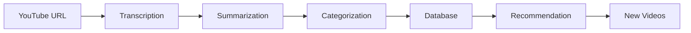

# AI Modules Overview 🤖

## نظرة عامة على وحدات الذكاء الاصطناعي

هذا المجلد يحتوي على كل الوحدات المتعلقة بالذكاء الاصطناعي في المشروع، مقسمة لـ4 أجزاء رئيسية:

## الوحدات الأربعة

### 1. 🎤 Transcription (التفريغ النصي)
**المسؤولية:** تحويل فيديوهات اليوتيوب لنصوص مكتوبة.

**الملفات:**
- `audio_downloader.py` - تحميل الصوت من YouTube
- `whisper_transcriber.py` - تحويل الصوت لنص باستخدام Whisper
- `audio_processor.py` - معالجة وفحص جودة الملفات الصوتية

**التقنيات:** OpenAI Whisper, yt-dlp, PyTorch

---

### 2. 📝 Summarization (التلخيص)
**المسؤولية:** تحويل النصوص لملاحظات دراسية منظمة.

**الملفات:**
- `note_generator.py` - توليد الملاحظات باستخدام Gemini
- `schemas.py` - تعريف هيكل البيانات
- `segmenter.py` - تقسيم النصوص الطويلة

**التقنيات:** Google Gemini, Pydantic

---

### 3. 🎯 Recommendation (الاقتراحات)
**المسؤولية:** اقتراح فيديوهات تعليمية جديدة للمستخدم.

**الملفات:**
- `recommender.py` - البحث في YouTube وتحليل الاهتمامات

**التقنيات:** YouTube Data API v3

---

### 4. 🏷️ Categorization (التصنيف)
**المسؤولية:** تصنيف الملاحظات تلقائياً.

**الملفات:**
- `categorizer.py` - تصنيف النصوص باستخدام AI

**التقنيات:** Google Gemini

---

## سير العمل الكامل (Full Pipeline)



1. **المستخدم يدخل رابط YouTube** → وحدة Transcription
2. **يتم تحميل الصوت وتحويله لنص** → وحدة Summarization
3. **يتم تلخيص النص وتنظيمه** → وحدة Categorization
4. **يتم تصنيف الملخص** → Database
5. **بناءً على الملاحظات المحفوظة** → وحدة Recommendation
6. **يتم اقتراح فيديوهات جديدة** → المستخدم

---

## للفريق: كيف تبدأ؟

### إذا كنت مسؤولاً عن Transcription:
1. افتح مجلد `transcription/`
2. اقرأ ملف `README.md` الموجود فيه
3. اختبر الكود باستخدام الأمثلة الموجودة
4. طور الميزات المقترحة

### إذا كنت مسؤولاً عن Summarization:
1. افتح مجلد `summarization/`
2. اقرأ ملف `README.md`
3. جرب تعديل الـ Prompts لتحسين جودة الملخصات
4. أضف ميزات جديدة (مثل الترجمة)

### إذا كنت مسؤولاً عن Recommendation:
1. افتح مجلد `recommendation/`
2. اقرأ ملف `README.md`
3. طور آلية الـ Caching لتوفير الـ API Quota
4. حسّن دقة الاقتراحات

### إذا كنت مسؤولاً عن Categorization:
1. افتح مجلد `categorization/`
2. اقرأ ملف `README.md`
3. أضف قائمة محددة من الـ Categories
4. حسّن الـ Prompt لزيادة الدقة

---

## ملاحظات عامة

### المكتبات المشتركة
جميع الوحدات تستخدم:
- `src.utils.logger` - للـ Logging
- `src.utils.config` - لقراءة الإعدادات من `.env`

### الاختبار
لاختبار أي وحدة، استخدم:
```bash
cd D:\faculty\Class4\grad\program
python -m pytest tests/
```

### البيئة المطلوبة
تأكد من تثبيت المكتبات:
```bash
pip install -r requirements.txt
```

### المتغيرات البيئية المطلوبة
في ملف `.env`:
```
GOOGLE_API_KEY=your_google_api_key_here
WHISPER_MODEL_SIZE=base
DATABASE_URL=your_database_url
```

---

## تواصل الفريق
- إذا واجهتك مشكلة في وحدة معينة، **افتح Issue** على GitHub.
- إذا أضفت ميزة جديدة، **حدث ملف README** الخاص بالوحدة.
- قبل الـ Commit، تأكد من أن الكود يعمل بدون أخطاء.

**بالتوفيق للفريق! 🚀**
