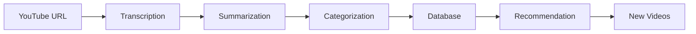

# AI Modules Overview 🤖

## Overview of AI Modules

This directory contains all AI-related modules in the project, divided into 4 main components:

## The Four Modules

### 1. 🎤 Transcription
**Responsibility:** Convert YouTube videos to written text.

**Files:**
- `audio_downloader.py` - Download audio from YouTube
- `whisper_transcriber.py` - Convert audio to text using Whisper
- `audio_processor.py` - Process and validate audio file quality

**Technologies:** OpenAI Whisper, yt-dlp, PyTorch

---

### 2. 📝 Summarization
**Responsibility:** Convert text to organized study notes.

**Files:**
- `note_generator.py` - Generate notes using Gemini
- `schemas.py` - Define data structure
- `segmenter.py` - Split long texts

**Technologies:** Google Gemini, Pydantic

---

### 3. 🎯 Recommendation
**Responsibility:** Suggest new educational videos to users.

**Files:**
- `recommender.py` - Search YouTube and analyze interests

**Technologies:** YouTube Data API v3

---

### 4. 🏷️ Categorization
**Responsibility:** Automatically categorize notes.

**Files:**
- `categorizer.py` - Categorize text using AI

**Technologies:** Google Gemini

---

## Complete Workflow (Full Pipeline)



1. **User enters YouTube URL** → Transcription module
2. **Audio is downloaded and converted to text** → Summarization module
3. **Text is summarized and organized** → Categorization module
4. **Summary is categorized** → Database
5. **Based on saved notes** → Recommendation module
6. **New videos are suggested** → User

---

## For Team Members: How to Start?

### If you're responsible for Transcription:
1. Open `transcription/` directory
2. Read the `README.md` file inside
3. Test the code using the provided examples
4. Develop the proposed features

### If you're responsible for Summarization:
1. Open `summarization/` directory
2. Read the `README.md` file
3. Try modifying the prompts to improve summary quality
4. Add new features (like translation)

### If you're responsible for Recommendation:
1. Open `recommendation/` directory
2. Read the `README.md` file
3. Develop caching mechanism to save API quota
4. Improve recommendation accuracy

### If you're responsible for Categorization:
1. Open `categorization/` directory
2. Read the `README.md` file
3. Add a predefined list of categories
4. Improve the prompt to increase accuracy

---

## General Notes

### Shared Libraries
All modules use:
- `src.utils.logger` - For logging
- `src.utils.config` - For reading settings from `.env`

### Testing
To test any module, use:
```bash
cd D:\faculty\Class4\grad\program
python -m pytest tests/
```

### Required Environment
Make sure to install the libraries:
```bash
pip install -r requirements.txt
```

### Required Environment Variables
In `.env` file:
```
GOOGLE_API_KEY=your_google_api_key_here
WHISPER_MODEL_SIZE=base
DATABASE_URL=your_database_url
```

---

## Team Communication
- If you encounter a problem in a specific module, **open an Issue** on GitHub.
- If you add a new feature, **update the README** file for that module.
- Before committing, make sure the code runs without errors.

**Good luck to the team! 🚀**
